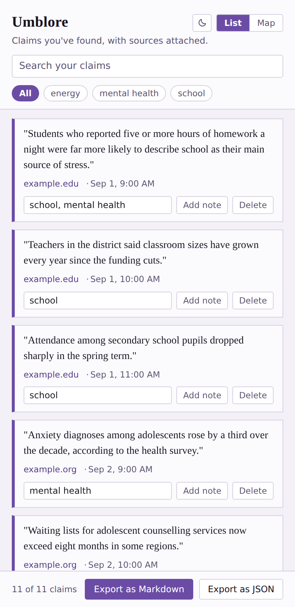
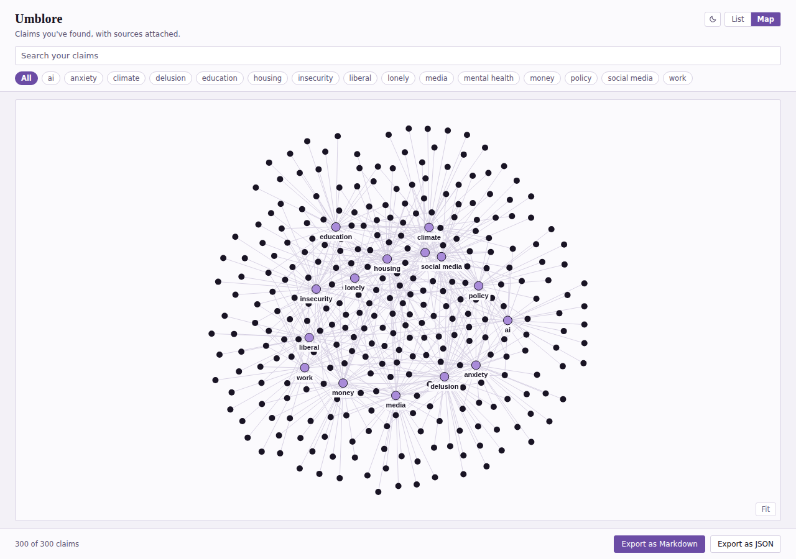
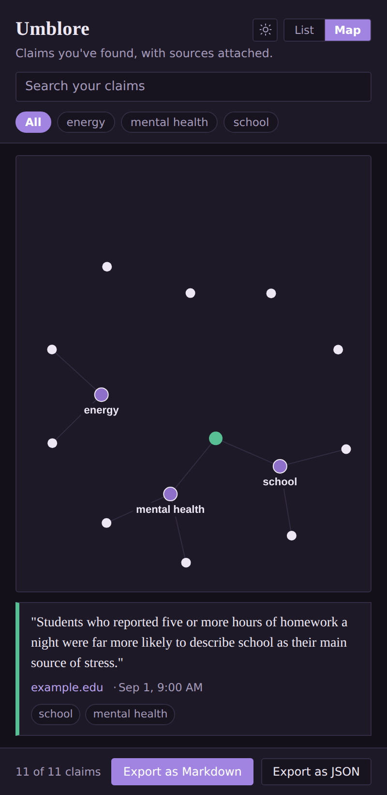

# Umblore

A small Chrome extension for keeping a quote or claim tied to where it came from — while you're still on the page, not after you've lost track of the tab.

Highlight something, right-click, and it saves the text along with the source URL and a timestamp. No account, no library to set up first, nothing leaves your machine.

## Why

Research and reporting both involve the same failure: you read something worth keeping across a dozen-plus tabs, and by the time you're writing it up, you can't remember which tab it came from — or why you thought it mattered. Read-later tools solve "read this later." Reference managers solve "cite this properly." Neither is built for the narrower, faster thing this does: grab the line, keep the source, note why, move on.

## The map

Tag a claim with one or more topics and the map view draws them as a graph. Purple nodes are topics, dark nodes are claims, and a claim tagged with several topics sits between them as a bridge — which is the point. Instead of filing each quote into exactly one folder, you can see where your material actually overlaps.

Click a claim to see it in full with its source — it turns green so you can see which one you're reading. Click a topic to filter everything down to it. Drag nodes around if the layout tangles.

Once you have a few dozen claims the map outgrows a side panel, so there's a button in the header that opens it in a full browser tab. Capture in the panel while you read, review in the tab when you sit down to write.

There's a light and a dark theme; it follows your system setting on first run and remembers whichever you pick.

## What it does

- **Highlight → right-click → save.** Captures the selected text, the page URL, the page title, and the time.
- **Optional full-page snapshot.** A second menu option also saves an offline `.mhtml` copy of the page, in case the source changes or disappears later.
- **Multiple topics per claim.** Comma-separated, free text — no fixed taxonomy to commit to up front.
- **Topic suggestions.** When a claim has no topics yet, it suggests ones you've already used that share distinctive wording with it. Click to apply. Nothing matches well enough, nothing is suggested.
- **Map view.** See how saved claims connect through shared topics.
- **Notes.** Attach a short note to a claim — why it matters, what to check next.
- **Search and filter.** By keyword, or by topic.
- **Export.** Markdown (grouped by topic, source and timestamp under each quote) or raw JSON.
- **Light and dark themes.** Defaults to your system preference, and remembers your choice.
- **Full-tab map.** Opens the same map in a browser tab when the side panel gets tight.

Everything lives in the browser's local storage. There's no server and no sync — this is a personal capture tool, not a team platform.

## What it deliberately doesn't do

- No persistent in-page annotation (the highlight doesn't stay visible on the page itself when you revisit it — it's pulled into a separate list instead).
- No cross-device sync.
- No PDF support — regular web pages only, for now.
- Snapshot capture is manual per-claim, not automatic for every page, on purpose — this is meant to stay lightweight rather than capture everything indiscriminately.
- No AI. It doesn't summarise, rank, or interpret anything for you. It stores what you chose to keep. Topic suggestions are plain word-frequency matching computed locally — they'll miss a connection between "pupils" and "undergraduates", and that's the trade for never sending your research anywhere.

## Install (unpacked, for now)

This isn't on the Chrome Web Store yet.

1. Clone or download this repo.
2. Go to `chrome://extensions`.
3. Turn on **Developer mode** (top right).
4. Click **Load unpacked** and select the `umblore` folder.
5. Pin it from the puzzle-piece icon in the toolbar.

## Use it

1. Highlight a sentence on any page.
2. Right-click → **Save claim to Umblore**, or **Save claim + page snapshot** if you want an offline copy too.
3. Click the toolbar icon to open the side panel and see what you've saved.
4. Add topics (comma-separated) and a note while it's fresh — or click a suggested topic if one fits.
5. Switch to **Map** once you've got a few, to see how they connect.
6. Export to Markdown when you're ready to write.

## Status

Early, personal-use MVP. Built to solve one specific problem for one specific workflow, not yet validated as something other people want in this exact form. Feedback — especially "this doesn't do X and it should," or "I wouldn't use this because Y" — is genuinely useful right now.

## License

MIT — see [LICENSE](LICENSE).
